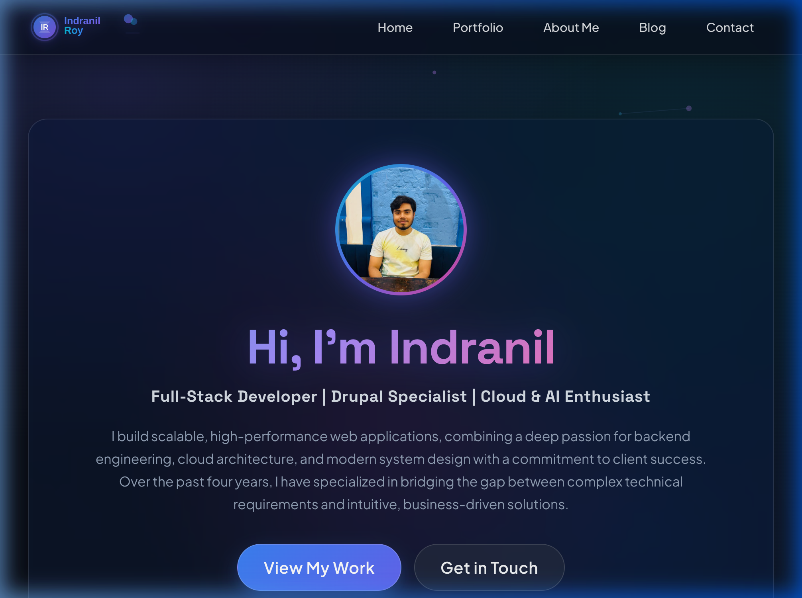

# 🌐 Developer Portfolio - Indranil Roy

[](https://reactjs.org/)
[](https://getbootstrap.com/)
[](https://sass-lang.com/)
[](https://www.docker.com/)
[](https://github.com/features/actions)
[](https://indranil836.github.io/portfolio)

A modern, responsive, high-performance developer portfolio application built with **React 19**, **Bootstrap 5**, **SCSS**, **GSAP**, and **tsParticles**. Features a glassmorphism design system, dynamic JSON-driven content sections, interactive contact form handling, an optional Express/Nodemailer backend with SHA-256 deduplication, Docker support, and automated GitHub Pages deployment via GitHub Actions.

---

## 📸 Preview

[](https://indranil836.github.io/portfolio)

> 🔗 **Live Site URL**: [https://indranil836.github.io/portfolio](https://indranil836.github.io/portfolio)

---

## 🌟 Key Features

- 🎨 **Glassmorphism & Dark Mode UI**: Modern aesthetic with dynamic visual hierarchy, backdrop blurs, crisp typography, and responsive grid layouts.
- ⚡ **Interactive Animations**: Dynamic hero particle animations driven by `react-tsparticles` and smooth state transitions powered by `gsap`.
- 🛠 **Dynamic Expertise & Project Display**: JSON-driven showcase (`Expertise.json`, `Articles.json`) for effortless updating of skills, projects, and articles.
- 📬 **Interactive Multi-Inquiry Contact Form**:
  - Supports multiple inquiry types (*Project Inquiries*, *Speaking Engagements*, *Mentoring*, *General*).
  - Integrated with **Web3Forms API** and custom Express.js backend.
  - Client-side input validation and error feedback.
- 🛡 **Robust Backend API** *(Optional)*:
  - Built with **Node.js** & **Express.js** (`backend/index.js`).
  - **Nodemailer SMTP Integration** for automated HTML email notifications.
  - **SHA-256 Hash Deduplication**: Prevents duplicate contact submissions.
  - Local JSON storage (`backend/submissions.json`) for audit logging.
- 📦 **Automated SCSS Pipeline**: SCSS modular stylesheets compiled, autoprefixed, and minified using **Gulp** (`gulpfile.js`).
- 🐳 **Docker & Docker Compose**: Complete containerized environment with hot-reloading for local development and maintenance workflows.
- 🚀 **Automated CI/CD**: Automated deployment pipeline using GitHub Actions (`.github/workflows/deploy.yml`) publishing directly to GitHub Pages.

---

## 🛠 Tech Stack

### **Frontend**
- **Core Framework**: React 19, React DOM
- **Routing**: React Router v7 (`react-router-dom`)
- **Styling**: Bootstrap 5, React Bootstrap, SCSS / Sass, Gulp (`gulp-sass`, `gulp-clean-css`, `autoprefixer`)
- **Animations & Effects**: GSAP, `react-tsparticles`, `tsparticles-slim`
- **Icons**: React Icons, FontAwesome, Bootstrap Icons
- **HTTP Client**: Axios

### **Backend & Services** *(In `backend/` directory)*
- **Runtime & Server**: Node.js, Express.js
- **Mail Service**: Nodemailer (Gmail SMTP)
- **Utilities**: Crypto (SHA-256), CORS, Dotenv
- **Form Gateway**: Web3Forms

### **DevOps & Infrastructure**
- **Containerization**: Docker, Docker Compose
- **CI/CD**: GitHub Actions
- **Hosting**: GitHub Pages

---

## 📁 Directory Structure

```text
portfolio/
├── .github/
│   └── workflows/
│       └── deploy.yml          # GitHub Actions deployment workflow
├── backend/
│   ├── index.js                # Express backend server with Nodemailer & submission logging
│   ├── submissions.json        # Persistent JSON submission store
│   └── package.json            # Backend dependencies
├── public/
│   ├── index.html              # Base HTML template with Inter Google Font
│   └── IR.svg                  # Favicon & brand icon
├── src/
│   ├── assets/                 # JSON data files, icons & portfolio preview image
│   │   ├── Articles.json       # Featured blog articles data
│   │   ├── Expertise.json      # Technical skills & expertise data
│   │   └── portfolio_preview.png # Portfolio home page preview screenshot
│   ├── Components/             # Modular UI components
│   │   ├── About.js            # About section
│   │   ├── Banner.js           # Hero banner with particles & GSAP
│   │   ├── Contact.js          # Interactive multi-inquiry contact form
│   │   ├── Expertise.js        # Technical skills & expertise showcase
│   │   ├── FeaturedBlog.js     # Featured articles & publications
│   │   ├── Header/             # Navigation navbar component & styles
│   │   └── Footer/             # Footer component & social links
│   ├── Pages/                  # View pages (Home.js, NoPage.js)
│   ├── styles/
│   │   ├── scss/               # SCSS source files & component modules
│   │   └── css/                # Compiled minified CSS output (index.min.css)
│   ├── App.js                  # Main Application Component with Router configuration
│   └── index.js                # React application entry point
├── Dockerfile                  # Node 20 Docker container configuration
├── docker-compose.yml          # Docker Compose service definition
├── gulpfile.js                 # SCSS build automation & watcher setup
└── package.json                # Frontend React dependencies & scripts
```

---

## 🚀 Getting Started

### Prerequisites

Ensure you have the following installed on your local machine:
- **Node.js** (v20+ recommended)
- **npm** (v10+ recommended)
- **Docker & Docker Compose** *(Recommended for isolated setup)*

---

### 💻 Local Development Setup (NPM)

1. **Clone the repository**:
   ```bash
   git clone https://github.com/indranil836/portfolio.git
   cd portfolio
   ```

2. **Install frontend dependencies**:
   ```bash
   npm install
   ```

3. **Compile SCSS Styles**:
   If you modify SCSS files in `src/styles/scss/`, compile them to CSS using Gulp:
   ```bash
   # Run one-time SCSS compilation
   npx gulp

   # Or start the watcher for live SCSS auto-compilation
   npx gulp watch
   ```

4. **Start the React development server**:
   ```bash
   npm start
   ```
   Open [http://localhost:3000](http://localhost:3000) to view the portfolio in your browser.

---

### ⚙️ Optional Backend Setup

The project includes an optional Node.js/Express backend for processing contact form submissions via Nodemailer and storing submission logs.

1. **Navigate to the backend directory**:
   ```bash
   cd backend
   npm install
   ```

2. **Configure environment variables**:
   Create a `.env` file inside the `backend` directory:
   ```env
   EMAIL_ID=your_gmail_address@gmail.com
   APP_KEY=your_gmail_app_password
   ```

3. **Run the backend server**:
   ```bash
   node index.js
   ```
   The backend server will run on port `9013`.

---

## 🐳 Docker Setup & Maintenance Guide

Complete list of Docker and Docker Compose commands for setting up, running, monitoring, debugging, and maintaining the portfolio application.

### 1. Initial Setup & Launching

```bash
# Build images and start container in foreground (with live logs)
docker-compose up --build

# Build and start container in detached mode (background)
docker-compose up -d --build
```
Access the containerized app at [http://localhost:3000](http://localhost:3000).

---

### 2. Status & Resource Monitoring

```bash
# View status of running container services
docker-compose ps

# Stream live container logs (all services)
docker-compose logs -f

# Stream live logs for the portfolio service only
docker-compose logs -f portfolio

# Monitor CPU, memory, network I/O usage in real-time
docker stats portfolio-react-app
```

---

### 3. Container Lifecycle Management

```bash
# Stop running containers gracefully (without removing them)
docker-compose stop

# Start previously stopped containers
docker-compose start

# Restart containers
docker-compose restart

# Stop and remove containers, networks, and default volumes
docker-compose down

# Stop and remove containers, networks, and ALL associated volumes
docker-compose down -v
```

---

### 4. Interactive Shell & Execution Inside Container

```bash
# Open an interactive Alpine shell terminal inside the running container
docker-compose exec portfolio sh

# Run SCSS compilation via Gulp inside container
docker-compose exec portfolio npx gulp

# Run test suite inside container
docker-compose exec portfolio npm test
```

---

### 5. Maintenance, Rebuilding & System Cleanup

```bash
# Force a clean build of Docker images from scratch (bypassing layer cache)
docker-compose build --no-cache

# Remove stopped containers, unused networks, and dangling images
docker system prune -f

# Complete deep cleanup: Remove unused containers, images, networks, and volumes
docker system prune -a --volumes -f
```

---

## 🎨 SCSS Build Pipeline

The project utilizes SCSS for modular styling. The Gulp workflow compiles SCSS into minified CSS with vendor prefixes automatically.

- **Source Directory**: `src/styles/scss/`
- **Output Destination**: `src/styles/css/index.min.css`

Available Gulp commands:
```bash
npx gulp          # Compiles SCSS -> autoprefixes -> minifies -> outputs CSS
npx gulp watch    # Watches SCSS files for changes and re-compiles automatically
```

---

## 📦 Scripts Overview

In the project root directory, you can run:

| Command | Description |
| :--- | :--- |
| `npm start` | Runs the React frontend app in development mode on port `3000`. |
| `npm run build` | Builds the production bundle in the `build` folder. |
| `npm run predeploy` | Automatically runs `npm run build` before deploying. |
| `npm run deploy` | Deploys the built app to GitHub Pages (`gh-pages` branch). |
| `npm test` | Launches the Jest test runner. |

---

## 🚢 CI/CD & Deployment

This repository uses **GitHub Actions** for automated build and deployment to GitHub Pages upon pushing to the `master` branch.

### GitHub Actions Workflow (`.github/workflows/deploy.yml`)
- Triggers automatically on push to `master`.
- Sets up Node.js 20 environment and caches `npm` dependencies.
- Runs `npm ci` and `npm run build` (injecting `REACT_APP_WEB3FORMS_ACCESS_KEY` secret if present).
- Deploys the `build/` directory output directly to the `gh-pages` branch using `JamesIves/github-pages-deploy-action`.

---

## 👤 Author

**Indranil Roy**
- GitHub: [@indranil836](https://github.com/indranil836)
- Live Site: [https://indranil836.github.io/portfolio](https://indranil836.github.io/portfolio)

---

## 📄 License

This project is open source and available under the [MIT License](LICENSE).
